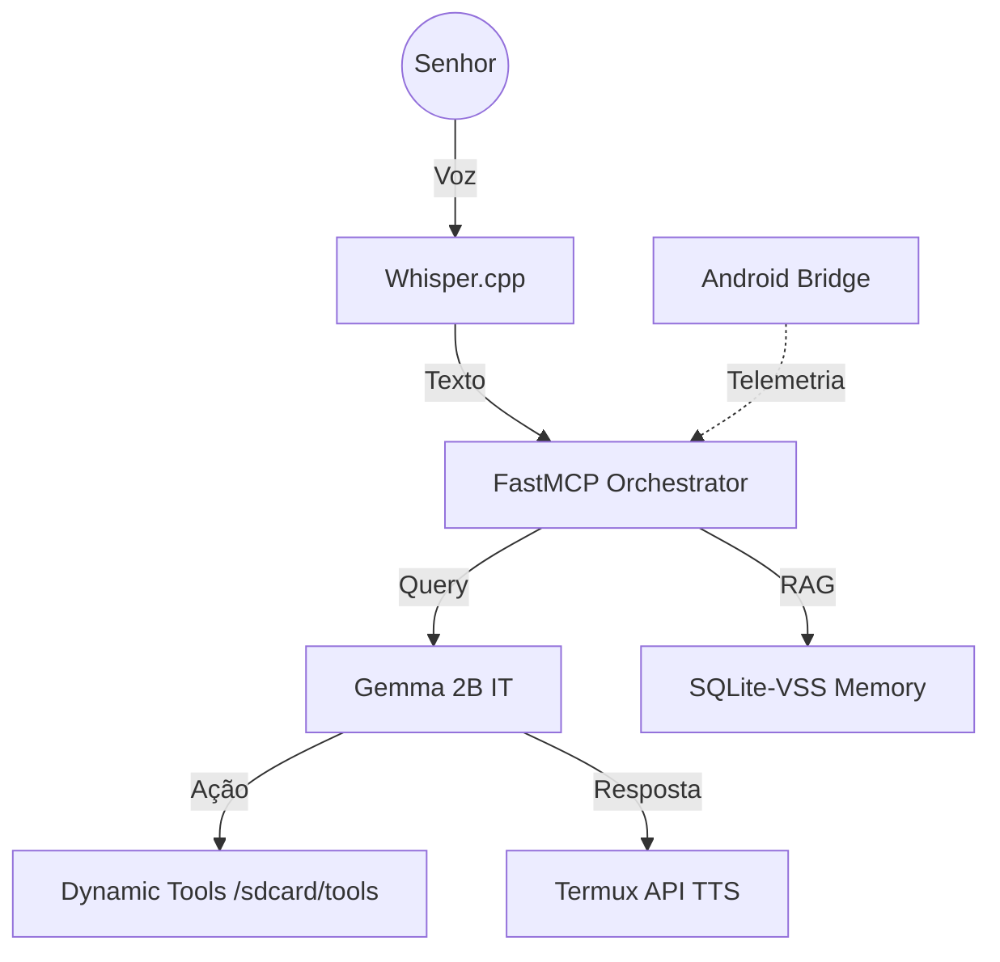

# 💎 February AI (Feb)

> **Local-First AI Assistant for Android with Elite February Protocol.**

[](https://f-droid.org/packages/com.termux/)
[](https://www.python.org/)
[](https://modelcontextprotocol.io)

**February** is a high-performance, private-by-design AI orchestrator built for low-latency voice interaction on mobile hardware. Designed to run strictly offline on hardware like the **Redmi Note 10S**, it fuses state-of-the-art LLMs with a dynamic plugin architecture (The Tesseract).

---

## ⚡ Core Features

- **🛡️ Sentinel Driver:** Real-time hardware telemetry (thermal & battery) integrated into the LLM context.
- **🧠 Semantic Tesseract:** Long-term memory using vector search (SQLite-VSS + BGE-Micro) for personalized recall.
- **🎙️ February Protocol:** Elegant, calm, and professional voice interaction (STT/TTS) with native Android integration.
- **🔌 Hot-Reload Skills:** Dynamic tool registration via `importlib` - add new skills in real-time without restarts.
- **🌡️ Thermal Awareness:** Hard-cap token limits and lazy-loading logic to protect mobile SoC health.

## 🏗️ Technical Architecture



## 🚀 Quick Start (Android Deployment)

To deploy February on your device, ensure you have **Termux** and **Termux:API** installed from F-Droid.

1. **Clone the repository:**
   ```bash
   git clone https://github.com/your-repo/FEBRUARY.FEB.AI
   cd FEBRUARY.FEB.AI
   ```

2. **Zero-Touch Onboarding:**
   Run the sentinel script to automate system dependencies, Git identity, and power management:
   ```bash
   chmod +x scripts/deploy_android.sh
   ./scripts/deploy_android.sh
   ```

3. **Wake up February:**
   ```bash
   python src/server.py
   ```

More details in [Android Deployment Guide](docs/android_deployment.md).

## 📂 Project Structure

- `src/`: Core logic (LLM Controller, Vector Engine, Android Bridge).
- `tools/`: Dynamic plugin directory for MCP tools.
- `docs/`: Technical documentation and [Agile Backlog](docs/agile_backlog.md).
- `scripts/`: Implementation and deployment automation.

---

## ⚖️ License & Privacy

**February** is local-first. No audio, text, or metadata ever leaves your device's memory. This is your personal intelligence, sovereign and private.

*"Sistemas estáveis, Senhor. Às suas ordens."* 🏙️🦾🎙️
